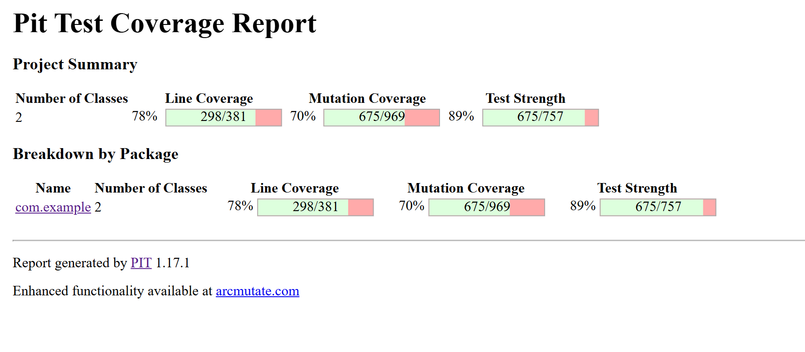
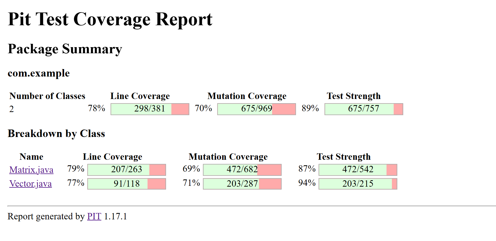

# Description

* This project tests the coverage of PIT mutations 
using test cases written in JUNIT.

* Test cases are written for a Linear Algebra Library

* There are two base classes for this Library, one is Matrix.java and another is Vector.java

* Concepts learned- Unit testing and Mutation Testing

* Tools learned- JUnit, MAVEN and PIT

# Output

# To run the project, follow these steps:

* Clean Build Artifacts: Begin by cleaning the project to remove any previously compiled files and ensure a fresh build environment.

* Compile the Project: Compile the source code to generate the necessary class files.

* Run the Application: Use the compiled JAR file to execute the main class and start the application.

* Run Unit Tests: Execute the unit tests to verify the code's correctness.

* Perform Mutation Testing: Compile the test code and use a mutation testing tool to assess the quality of your tests by checking how well they catch intentional code changes.

# Main Source File

* the main file runs some basic operations like creating objects and using constructors, then applying some unary and binary operations.
* it can be run saparately, without running the tests on it
* the open source contributer for the file is https://github.com/danhales/linearalgebra

# Test Files

* there are two test files written one for matrix function testing and other for vector function testing.
* the files contain tests written in JUnit.
* futher results of PIT are shown above in screenshots.

# Matrix.java

* contains all the baisc and advanced operations on matrix
* Some unary operations are
determinant, isDiagonal, isLowerTriangular, isSparse, swapColumns, transpose and isSquare.
* some Binary operations are add, subtract and multiply.

# Vector.java

* contains all the basic and advanced opertaions on vector.
* some unary operations on vectors are inversevector, iszero, length, magnitude,
and normalize.
* some binary operations on vectors are add, cross, dot and subtract.

